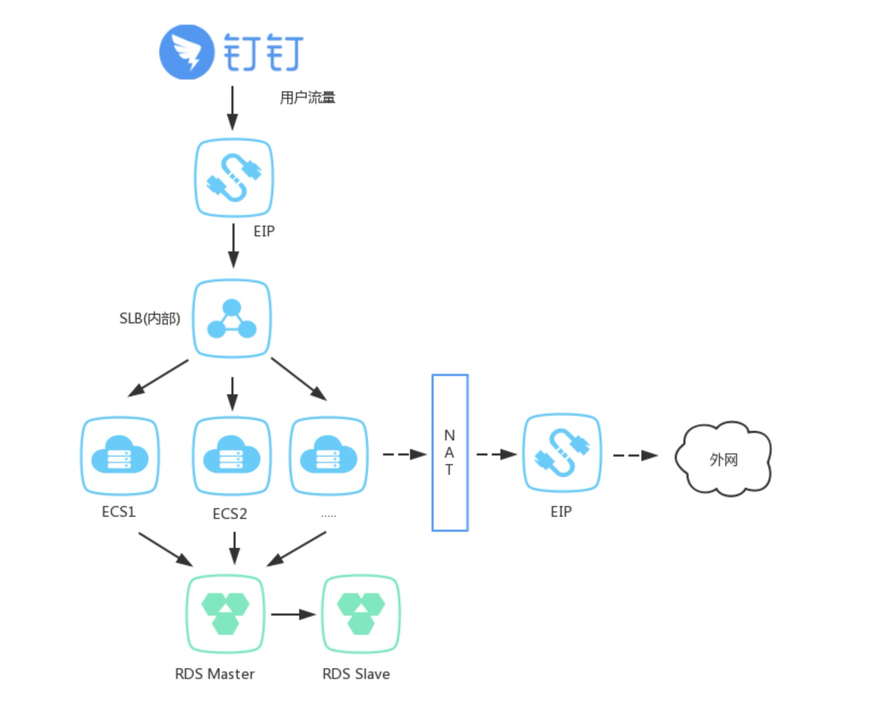
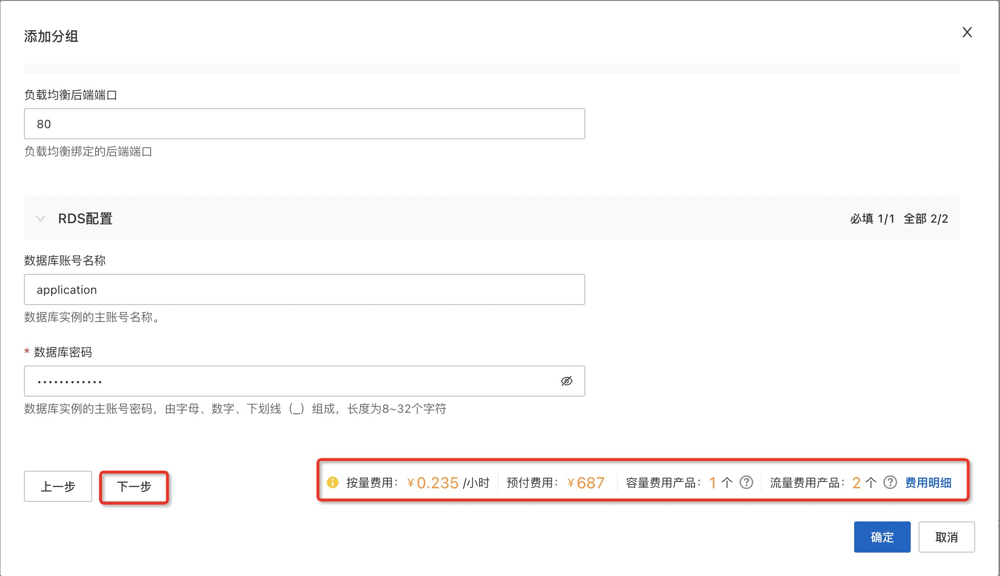
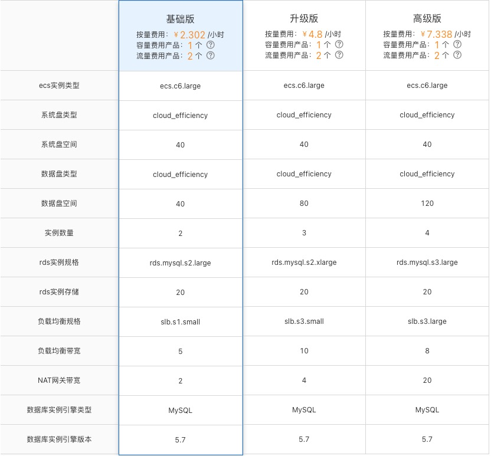
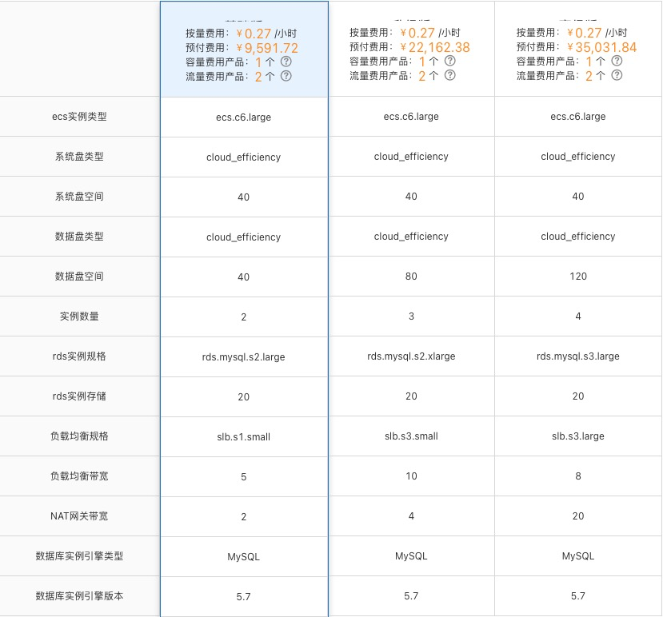
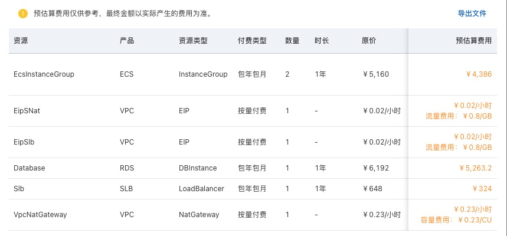
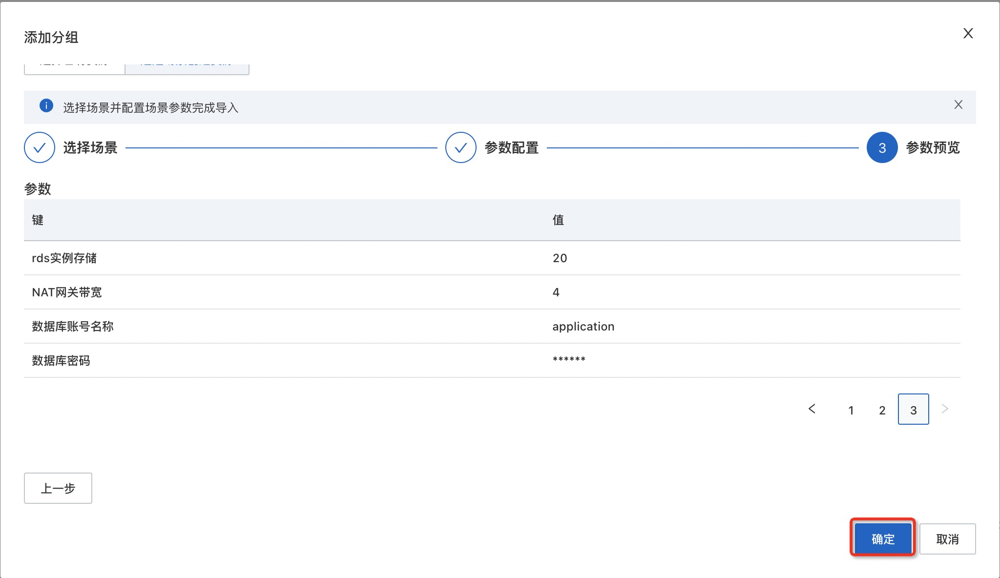
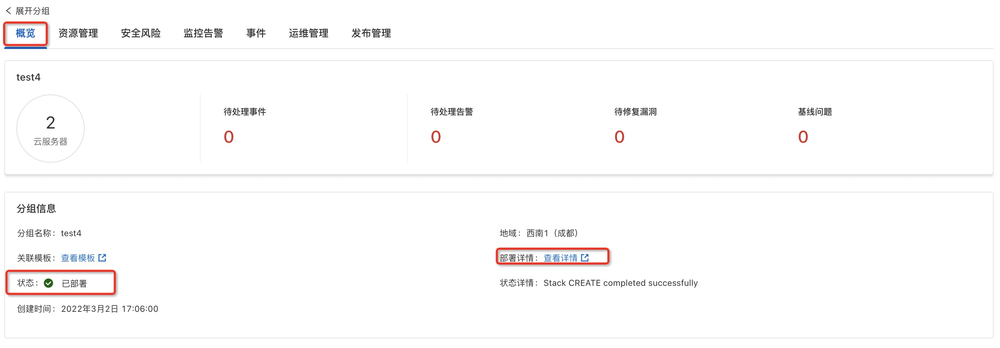

# 钉钉应用ECS环境的说明文档

## 概述

此应用模板提供了一个快速创建钉钉应用的方案，该应用模板符合钉钉应用基础设施的架构，
钉钉应用基础设施的架构如下图所示：

部署完成的应用分组包含一个或多个ECS实例、一个RDS实例、一个SLB实例和NAT网关
- ECS实例自动加入SLB后端服务器组。
- ECS实例的Ip自己加入到RDS实例的安全白名单中
- SLB实例绑定弹性公网IP提供公网服务，ECS实例不开公网提高安全性。

## 计费说明
部署此应用的费用主要涉及：

- 所选vCPU与内存规格
- 磁盘容量
- 公网带宽
- 所选SLB规格
- 所选数据库的规格
- 

计费方式包括：

- 按量付费（小时）
- 包年包月

预估费用在部署前可实时看到。

## RAM账号所需权限
若您使用RAM用户创建应用，为了使用应用管理的完整功能，需要对使用的RAM用户的账号添加相应资源的权限。添加RAM权限的详细操作，请参见[为RAM用户授权](https://help.aliyun.com/document_detail/455313.html)。

为了部署此应用，所需权限如下表所示。

| 权限策略名称                       | 备注 |
|------------------------------| --- |
| AliyunECSFullAccess          | 管理云服务器服务（ECS）的权限 |
| AliyunVPCFullAccess          | 管理专有网络（VPC）的权限 |
| AliyunROSFullAccess          | 管理资源编排服务（ROS）的权限 |
| AliyunCloudMonitorFullAccess | 管理云监控（CloudMonitor）的权限 |
| AliyunSLBFullAccess          | 管理负载均衡服务（SLB）的权限|
| AliyunRDSFullAccess          | 管理云数据库服务(RDS)的权限|

## 部署流程

### 部署步骤
1. 访问应用管理控制台，点击“创建应用”后选择“通过模板创建”，再选择“钉钉应用ECS环境”模板，点击“使用模板”
2. 输入应用名称、应用描述后，点击“添加分组”
3. 输入部署参数，保存分组。保存前可以预览费用明细和参数。
   - 设置场景参数，按提示设置参数完成后会生成预估费用提示，点击费用明细可以查看费用详情，确认费用后点击下一步。
     
     - 套餐规格及费用预估（仅供参考，最终金额以实际产生的费用为准）详情如下：
       - 按量付费：
         
       - 预付费6个月：
         
       - 预付费1年：
         
     - 费用明细详情示例如下：
       
4. 确认已配置参数无误后，点击确定创建应用分组。
   

### 验证结果

1. 查看应用。应用创建成功后，环境部署时间大约需要1分钟。状态变为“已部署”即为部署完成
   
2. 应用分组部署完成后，您可以在"资源管理"标签下看到创建的所有资源。
   
3. 在资源中部署好您的软件，就可以访问您自己的服务了。